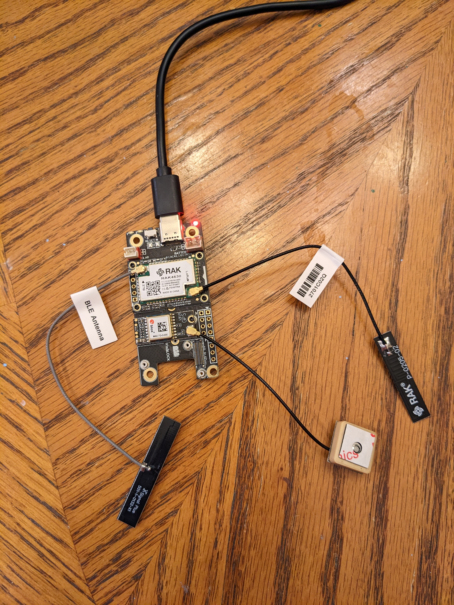

# Simple GPS Tracker
Docs 2-26-23 V1 (For questions or comments:  Stephen Witty switty@level500.com)  

### Project Overview:
This project is a simple GPS tracker application that sends up GPS coordinates every 20 seconds using the RAK4631 and GPS module.  It communicates data via the Helium LoRa network.  Data decoders are included for the Helium console and DataCakes.  The code is based on the RAK GPS tracking example included with the Arduino IDE after RAK is installed.  The changes are very minor including removing accelerometer activation for data transmission. 

This project should be consider demo/POC quality.

### Many thanks:
- The Mycelium Networks Builder Program for support and encouragement
- RAK Wisblock for excellent hardware offerings and code examples

 &nbsp; &nbsp; &nbsp; &nbsp; &nbsp; &nbsp; &nbsp; &nbsp;

### Hardware:
- RAK4631 - MCU
- RAK5005-O - Baseboard
- RAK1910 - GPS module (installed in slot A)
- BLE, LoRa and GPS antennas

### Project files:
- Documentation - ReadMe.md
- Primary Source Code - Simple_GPS_Tracker.ino (Aurdrino sketch)
- Header file - keys.h (Contains Helium user application keys)
- DataCake decoder file - DataCake_decoder.txt
- Helium console decoder  file - Helium_decoder.txt

### Circuit:
- None

### Operation:
When powered on, the MCU will try and connect to the Helium LoRa network.  If unsuccessful, the MCU must be restarted to try again.  If connected to LoRa and after a GPS location lock, the MCU will begin to transmit GPS coordinates over LoRa.

### LED meaning:
- Orange LED means the MCU is powered
Built in green LED is used as a diagnostic
- slow flash - trying to join LoRa network (this starts right after MCU boot)
- rapid flash - LoRa network join failed (must reboot MCU to recover)
- solid green - LoRa network joined
- one second green off and then back on - LoRa message sent (this means GPS lock was made)

### Misc:
- Your Helium keys must be entered into keys.h

- A GPS lock can take a long time.  If indoors, this may never happen.

- The sketch does output diagnostic information over the serial port that is helpful for troubleshooting.

- Two data decoders are provided.  One is to be installed as a Helium function.  The other is a DataCake decoder.  They are intended to work together.  A DataCake map widget can be created from the data for use as a dashboard map.

- The MCU can be powered from the USB port or battery connections on the RAK baseboard.

